[](https://registry.terraform.io/modules/seu-nome-de-usuario/seu-modulo)
[](https://aws.amazon.com/)
[](https://www.serverless.com/)
[](https://aws.amazon.com/sqs/)
[](https://aws.amazon.com/api-gateway/)
[](https://aws.amazon.com/ses/)
[](https://aws.amazon.com/s3/)
[](https://aws.amazon.com/dynamodb/)


# Hackathon (GRUPO 31) - Framework ( Infraestrutura e Apis )

Este repositório contém o projeto desenvolvido para o hackathon. Utilizando o Serverless Framework, o processo de provisionamento da infraestrutura na nuvem é automatizado através deste framework com ativação requisitada via Terraform. Abaixo estão os serviços de nuvem que são provisionados.

* 1 Api Gateway
* 1 Cognito (Pool)
* 1 Dynamodb (Tables)
* 1 S3 (Bucket)
* 1 Sqs (Queue)
* 1 SES (Mail)
* 1 Lambda: Signup (cadastrar usuário no cognito)
* 1 Lambda: Login (Autenticação de usuário com e-mail e senha)
* 1 Lambda: Registro de ponto (marcação de ponto)
* 1 Lambda: Visualização de registros (pontos marcados por período)
* 1 Lambda: Solicitar relatório de espelho de ponto (requisição)
* 1 Lambda: Consulta pedidos de relatórios (requisição)
* 1 Lambda: Processar relatório e enivar por e-mail e armazenar em s3


<a id="ancora0"></a>
# Sumário
>

- [MVP Fase 1](#ancora1)
    - [Desenho da Solução MVP](#ancora2)
    - [Contextos Delimitados (Bounded Contexts)](#ancora3)
    - [Principais Componentes e Design](#ancora4)
    - [Modelagem databse (base)](#ancora5)
    - [Documentação das API's](#ancora6)
    - [Diagrama de sequência das API's](#ancora7)
- [MVP ( FASE 2 )](#ancora8)
    - [Desenho da Solução MVP (FASE 2)](#ancora9)
    - [Contextos Delimitados (Bounded Contexts)](#ancora10)
    - [### Principais Componentes e Design](#ancora11)
- [Rpid (LGPD)](#ancora12)
- [Instalação](#ancora13)
- [Execução de Testes unitários](#ancora14)
- [Provisonamento em Cloud AWS](#ancora15)
- [AWS configuração](#ancora16)
- [Pipeline](#ancora17)
- [Execução do projeto](#ancora18)

<a id="ancora1"></a>
# MVP ( FASE 1 )
>


O MVP do sistema de ponto eletrônico interno para a Hackaton Company SA, utiliza os serviços AWS escolhidos, que foi fundamental garantir que o design da solução seja robusto, escalável, e segura, atendendo tanto aos requisitos funcionais quanto aos não funcionais especificados. A seguir, descrevo o desenho da solução, justificando as escolhas técnicas e abordando os requisitos solicitados:

<a id="ancora2"></a>
## Desenho da Solução MVP
>


- #### Autenticação de Usuário com Amazon Cognito

    **Escolha Técnica**: Amazon Cognito será utilizado para a autenticação de usuários. Cognito oferece um serviço seguro de gerenciamento de identidade e autenticação, suportando autenticação com nome de usuário (ou matrícula) e senha, além de integrar facilmente com APIs.

    **Justificativa**: Esta escolha atende ao requisito de segurança, garantindo que os dados dos usuários sejam protegidos através de práticas recomendadas de segurança, como criptografia e tokens de autenticação. Além disso, simplifica o gerenciamento de usuários e escala automaticamente para atender qualquer número de usuários.

- #### Registro e Visualização de Ponto com AWS Lambda e Amazon DynamoDB
    
    **Escolha Técnica**: AWS Lambda é usado para executar o código das APIs de registro de ponto e visualização de registros, com Amazon DynamoDB como banco de dados para armazenar esses registros.

    **Justificativa**: Lambda permite a execução de código em resposta a eventos (neste caso, requisições HTTP através do API Gateway), de forma escalável e com gerenciamento de recursos automático, endereçando os requisitos de desempenho e escalabilidade. DynamoDB, por sua vez, oferece um armazenamento de dados NoSQL altamente disponível e de baixa latência, garantindo a integridade dos dados e a capacidade de suportar um grande número de acessos simultâneos, crucial para o horário de pico de registros.

- #### Geração e Envio de Relatórios com AWS SES para envio e Amazon SQS para enfileiramento e Amazon DnynamoDB para dados

    **Escolha Técnica**: Para a geração e envio de relatórios, será utilizado o Amazon Simple Email Service (SES) para o envio de e-mails, com a geração de relatórios sendo enfileirada de forma assíncrona usando Amazon Simple Queue Service (SQS) e gerado pela AWS Lambda onde os dados são coletados do Dynamodb.

    **Justificativa**: SES é uma plataforma de envio de e-mail escalável que permite enviar relatórios por e-mail de forma eficiente, atendendo ao requisito de relatórios. SQS permite desacoplar a geração de relatórios da solicitação de geração, gerenciando picos de demanda sem afetar a performance das outras funcionalidades do sistema, o que é essencial para a escalabilidade e a resiliência do sistema.

- #### API Gateway para Exposição de APIs

    **Escolha Técnica**: Amazon API Gateway será utilizado para expor as APIs desenvolvidas em AWS Lambda ao mundo externo, atuando como um ponto de entrada para as requisições. As rotas são acessíveis apenas com o access_token gerado pelo autenticação no AWS Cognito.

    **Justificativa**: API Gateway facilita o gerenciamento de APIs, oferecendo recursos como autenticação, monitoramento, e limites de taxa de requisição. Isso contribui para a segurança, desempenho e escalabilidade do sistema, além de oferecer um tempo de resposta rápido (atendendo ao requisito de até 5 segundos) devido à sua integração otimizada com AWS Lambda e Dynamodb.

- #### Considerações sobre Requisitos Não Funcionais

    **Desempenho e Escalabilidade**: Utilizando AWS Lambda e DynamoDB, o sistema é capaz de escalar automaticamente para atender demandas de até 100.000 colaboradores, inclusive durante os picos de requisições, mantendo um alto desempenho.

    **Disponibilidade**: Todos os serviços AWS escolhidos (Lambda, DynamoDB, Cognito, SES, SQS, API Gateway) oferecem alta disponibilidade e redundância, garantindo que o sistema esteja operacional 24/7.

    **Segurança**: A solução incorpora práticas de segurança recomendadas, como autenticação segura com Cognito, criptografia de dados em trânsito e em repouso (suportada por DynamoDB e SES), e proteção contra ataques comuns.

    **Manutenibilidade e Resiliência**: A arquitetura serverless e os serviços gerenciados reduzem a complexidade de manutenção e garantem uma rápida

[Voltar ao topo](#ancora0)

<a id="ancora3"></a>
## Contextos Delimitados (Bounded Contexts)
>


- #### Gestão de Identidade e Acesso
    Entidades: Usuário

    Serviços de Domínio: Autenticação, Autorização

    Integração: Amazon Cognito para gestão de identidades e autenticações

- #### Registro de Ponto
    Entidades: Registro de Ponto

    Agregados: Dia de Trabalho (agregando múltiplos registros de ponto)

    Serviços de Domínio: Criação de Registro, Cálculo de Horas Trabalhadas

    Integração: AWS Lambda para lógica de negócio, Amazon DynamoDB para persistência

- #### Visualização e Relatórios
    Entidades: Relatório de Ponto

    Serviços de Domínio: Geração de Relatórios, Visualização de Registros
    
    Integração: AWS Lambda para geração de relatórios, Amazon SQS para enfileiramento de tarefas assíncronas, Amazon SES para envio de relatórios por e-mail, Amazon DynamoDB para armazenamento de dados, Amazon S3 para armazenamento de relatórios gerados com ciclo de vida.

[Voltar ao topo](#ancora0)
<a id="ancora4"></a>
## Principais Componentes e Design
>

- **Autenticação** e Segurança: Utilizando Amazon Cognito, garantimos um sistema seguro de autenticação e gestão de identidades, alinhado com as melhores práticas de segurança.
- **Registro e Gestão de Ponto**: A combinação de AWS Lambda e Amazon DynamoDB permite um registro eficiente e seguro dos pontos, além de oferecer a escalabilidade necessária para o grande volume de transações.
- **Visualização e Geração de Relatórios**: AWS Lambda e Amazon SES são usados para processar e enviar relatórios, assegurando que os dados sejam acessíveis e comunicados de forma eficiente.

[Voltar ao topo](#ancora0)

<a id="ancora5"></a>
## Modelagem databse (base)
>


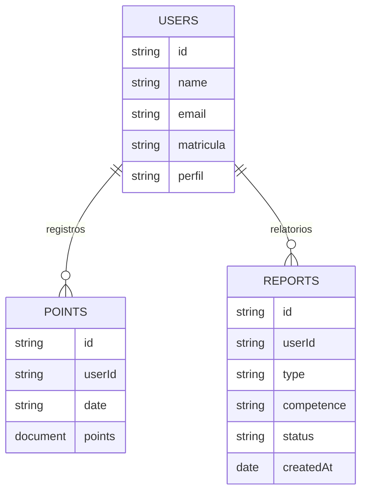

[Voltar ao topo](#ancora0)

<a id="ancora6"></a>
## Documentação das API's
>

A documentação das APIs foi elaborada utilizando a versão 1 do Postman Collection, e o arquivo para importação está disponível a seguir.

[Collection Api Postman](doc/Hackathon.postman_collection.json)
[Documentação em PDF](doc/HackathonCollection.pdf)

Para acessar uma visualização pública, clique no link abaixo.

https://documenter.getpostman.com/view/9751404/2sA358em6j

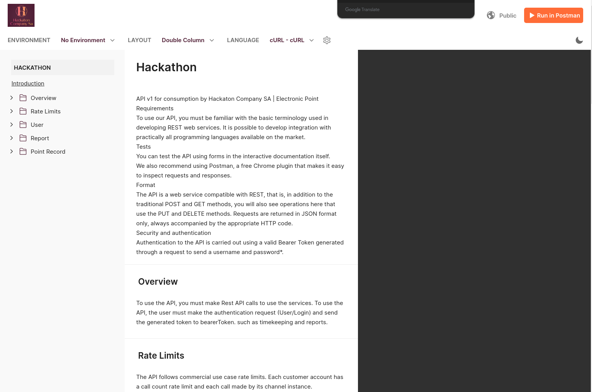

[Voltar ao topo](#ancora0)

<a id="ancora7"></a>
## Diagrama de sequência das API's
>


### Autenticação (Login)
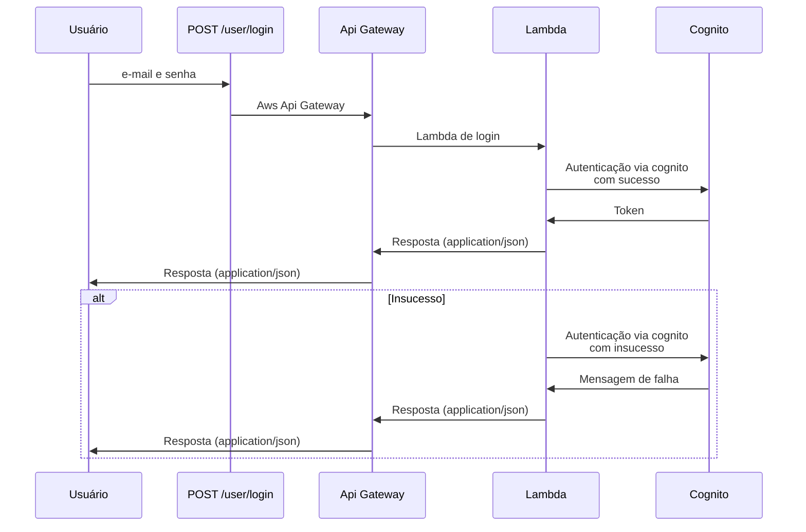

### Criação de usuário (Signup)
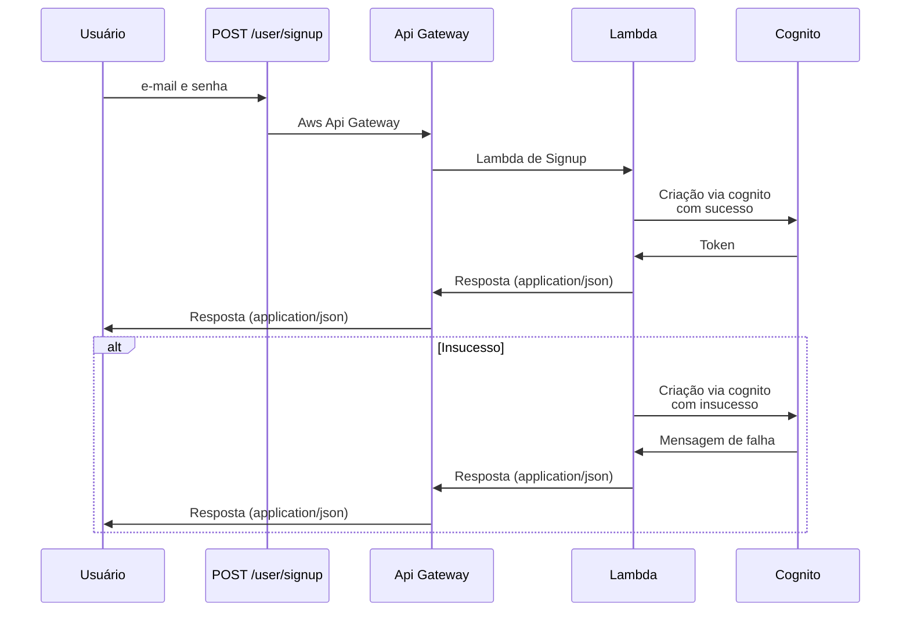

### Marcação de Ponto (Point Entry)
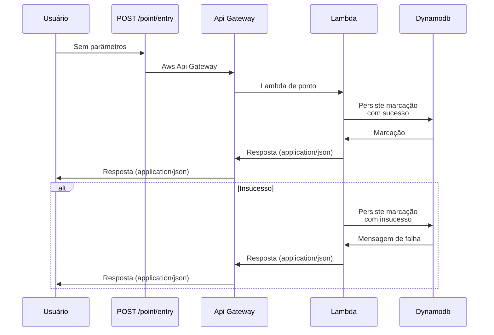

### Visualização de Ponto (Record View)
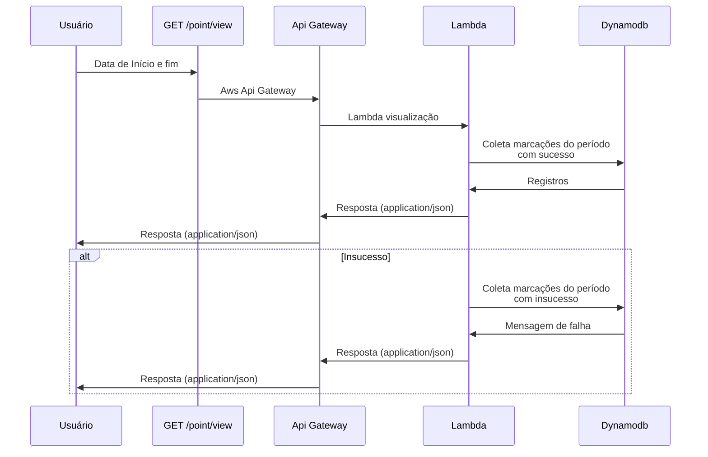

### Gerar espelho de ponto (Request Report)
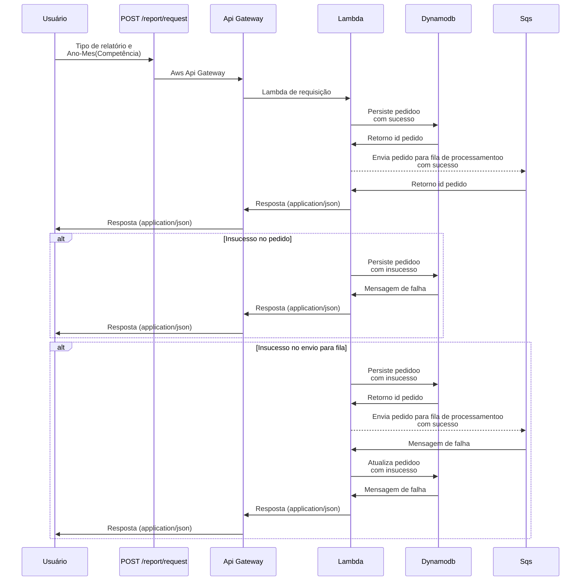

### Processo de geração do espelho de ponto (Report Generator)
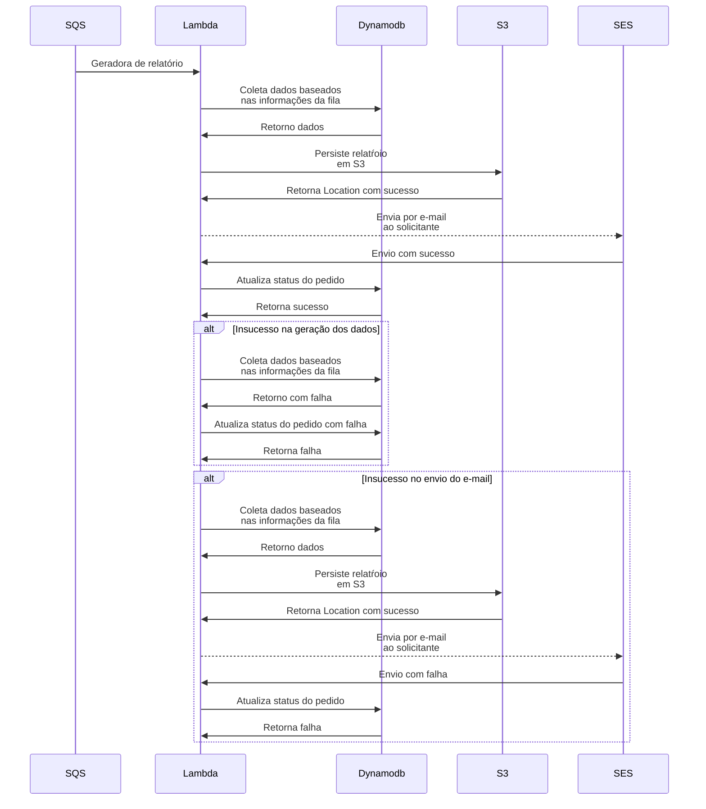

### Visualização de pedido de espelho de ponto (Get Request Report)
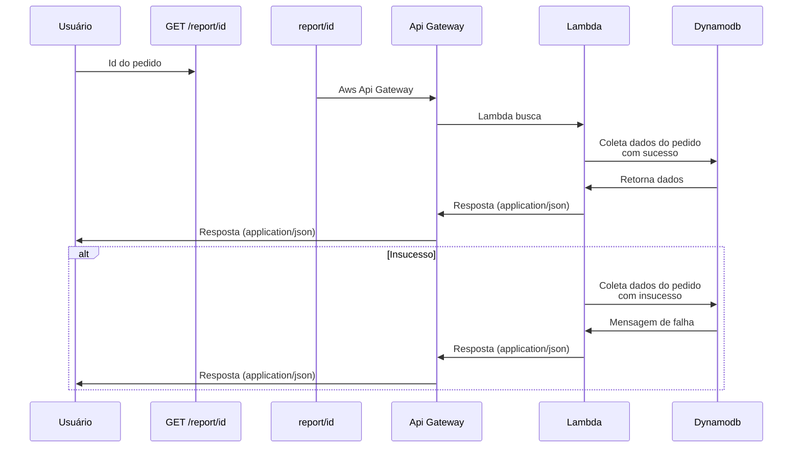

[Voltar ao topo](#ancora0)

<a id="ancora8"></a>
# MVP ( FASE 2 )
>

Para a fase 2 do projeto, onde buscamos incorporar funcionalidades adicionais como a edição de registros, envio de notificações, e um portal de administração, utilizaremos os serviços da AWS já mencionados e introduziremos novos componentes para atender aos requisitos. A adição do AWS EventBridge, Amazon S3, Amazon CloudFront e Amazon Simple Notification Service (SNS) fortalecerá a infraestrutura, garantindo uma solução abrangente, escalável e de alta performance. Aqui está como essas adições se encaixam no design da solução:

[Voltar ao topo](#ancora0)

<a id="ancora9"></a>
### Desenho da Solução MVP (FASE 2)
>


- #### Agendamento e Envio de Notificações com AWS EventBridge e Amazon SNS
    **Escolha Técnica**: AWS EventBridge será utilizado para agendar e disparar eventos baseados em regras, como a necessidade de enviar notificações para registro de ponto. Amazon SNS será usado para o envio dessas notificações aos usuários.

    **Justificativa**: EventBridge permite a criação de regras de eventos que facilitam a automação de workflows, como verificar periodicamente a necessidade de enviar lembretes de registro de ponto. Quando uma condição é satisfeita, EventBridge pode desencadear uma notificação através do SNS, que é capaz de enviar mensagens diretas aos usuários, seja por e-mail, SMS ou notificações push, atendendo ao requisito de notificações da fase 2.

- #### Portal de Administração Estático com Amazon S3 e Amazon CloudFront
    **Escolha Técnica**: Amazon S3 será utilizado para hospedar o portal de administração estático, enquanto Amazon CloudFront será usado para distribuir o conteúdo globalmente, garantindo acesso rápido e seguro.

    **Justificativa**: S3 oferece um armazenamento de objetos de alta durabilidade e disponibilidade, ideal para hospedar sites estáticos como o portal de administração. CloudFront, um CDN (Content Delivery Network), acelera a entrega do conteúdo hospedado no S3, reduzindo a latência e melhorando a experiência do usuário final. Além disso, CloudFront oferece benefícios de segurança, como a integração com AWS WAF, protegendo o portal contra ataques comuns da web.

- #### Manutenção dos Processos para Relatórios e Dashboards
    **Escolha Técnica**: A arquitetura baseada em API Gateway, AWS Lambda e Amazon DynamoDB continuará sendo utilizada para o desenvolvimento e exposição de APIs que suportam a geração de relatórios e dashboards.

    **Justificativa**: A manutenção dessa abordagem para relatórios e dashboards assegura uma integração consistente e eficiente com o restante da solução. AWS Lambda oferece flexibilidade e escalabilidade para processar as requisições de geração de relatórios, enquanto DynamoDB fornece um armazenamento de dados rápido e escalável para suportar as operações de dados. API Gateway facilita a exposição dessas funções como APIs RESTful, mantendo a segurança e a gestão eficaz do tráfego.

- #### Conclusão
    A expansão para a fase 2 introduzirá melhorias significativas na funcionalidade, usabilidade e eficiência do sistema de ponto eletrônico, alavancando a robusta gama de serviços da AWS. A inclusão de EventBridge e SNS aprimora a capacidade do sistema de se comunicar proativamente com os usuários, enquanto S3 e CloudFront proporcionam uma solução eficiente e segura para o portal de administração. Mantendo a arquitetura baseada em Lambda, DynamoDB e API Gateway para relatórios e dashboards, o sistema permanece ágil, escalável e capaz de atender às crescentes demandas da empresa. Este design cuidadosamente planejado garante que o sistema não apenas atenda aos requisitos funcionais e não funcionais estabelecidos, mas também ofereça uma plataforma para inovação contínua e melhorias no futuro.

[Voltar ao topo](#ancora0)

<a id="ancora10"></a>
### Contextos Delimitados (Bounded Contexts)
>

-  #### Gestão de Identidade e Acesso
    Entidades: Usuário

    Serviços de Domínio: Autenticação, Autorização

    Integração: Amazon Cognito para gestão de identidades e autenticações


- #### Registro de Ponto
    Entidades: Registro de Ponto

    Agregados: Dia de Trabalho (agregando múltiplos registros de ponto)

    Serviços de Domínio: Criação de Registro, Cálculo de Horas Trabalhadas

    Integração: AWS Lambda para lógica de negócio, Amazon DynamoDB para persistência


- #### Visualização e Relatórios
    Entidades: Relatório de Ponto

    Serviços de Domínio: Geração de Relatórios, Visualização de Registros
    
    Integração: AWS Lambda para geração de relatórios, Amazon SQS para enfileiramento de tarefas assíncronas, Amazon SES para envio de relatórios por e-mail, Amazon DynamoDB para armazenamento de dados, Amazon S3 para armazenamento de relatórios gerados com ciclo de vida.

- #### Administração do Sistema
    Entidades: Administrador, Configuração do Sistema

    Serviços de Domínio: Gestão de Usuários, Aprovação de Edições de Registros

    Integração: Amazon S3 para hospedagem do portal estático, Amazon CloudFront para distribuição de conteúdo

- #### Notificações
    Eventos de Domínio: Lembrete de Registro de Ponto, Alerta de Atividade

    Serviços de Domínio: Envio de Notificações

    Integração: AWS EventBridge para agendamento de tarefas, Amazon SNS para envio de notificações

[Voltar ao topo](#ancora0)

<a id="ancora11"></a>
### Principais Componentes e Design
>

- **Autenticação** e Segurança: Utilizando Amazon Cognito, garantimos um sistema seguro de autenticação e gestão de identidades, alinhado com as melhores práticas de segurança.
- **Registro e Gestão de Ponto**: A combinação de AWS Lambda e Amazon DynamoDB permite um registro eficiente e seguro dos pontos, além de oferecer a escalabilidade necessária para o grande volume de transações.
- **Visualização e Geração de Relatórios**: AWS Lambda e Amazon SES são usados para processar e enviar relatórios, assegurando que os dados sejam acessíveis e comunicados de forma eficiente.
- **Administração e Distribuição de Conteúdo**: Amazon S3 e CloudFront fornecem uma solução robusta para hospedagem e entrega rápida do portal de administração.
- **Comunicação e Notificações**: AWS EventBridge e Amazon SNS oferecem um meio eficaz de agendar e enviar notificações, mantendo os usuários informados e engajados.

[Voltar ao topo](#ancora0)

<a id="ancora12"></a>
## Rpid (LGPD)
>


RPID essencial para garantir que a organização esteja em conformidade com a LGPD, protegendo os direitos dos indivíduos e promovendo uma cultura de proteção de dados.

Abaixo documento

[Download](doc/RpidHackathon.pdf)

[Voltar ao topo](#ancora0)

<a id="ancora13"></a>
## Instalação
>

Execute o comando abaixo para instalação dos pacotes necessários para execução do projeto

```
npm install
```

Para versão em produção recomendas-se utilizar o parametro --production
```
npm install --production
```

[Voltar ao topo](#ancora0)

<a id="ancora14"></a>
## Execução de Testes unitários
>


O comando irá realizar através do JEST os testes unitários com coverage.

```
npm run test
```

[Voltar ao topo](#ancora0)

#### Resultado dos testes unitários (JEST)
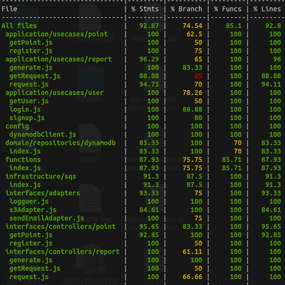

#### Resultado Quality Gate  (SONARQUBE)
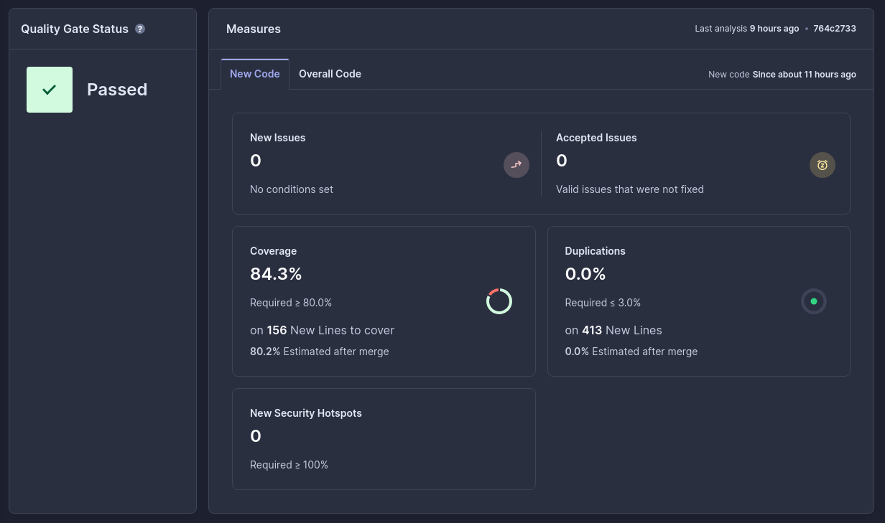
## Execução do projeto offline

O comando irá realizar através do JEST os testes unitários com coverage.

```
serverless offline
```
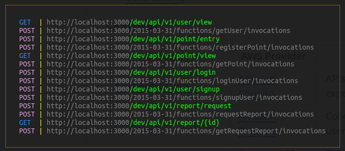

## Dependências para execução do projeto offline

O projeto utiliza-se de recursos de cloud não disponíveis diretamente em modo offline sem apoio de recursos adicionais.
Para tal recomenda-se a utilização do localstack

```
docker run \
  --rm -it \
  -p 4566:4566 \
  -p 4510-4559:4510-4559 \
  localstack/localstack
```

Acrescentar no serverless.yml o seguinte trecho

```
custom:
  localstack:
    stages:
      - local
    endpointFile: "${self:service}/localstack/endpoints.yml"

```
[Voltar ao topo](#ancora0)

<a id="ancora15"></a>
## Provisonamento em Cloud AWS
>


Esta execução esta fora do nível gratuito da AWS, importante avaliar antes de executar

[Voltar ao topo](#ancora0)

<a id="ancora16"></a>
## AWS configuração
>


Configure abaixo no secrets do github.

```
AWS_ACCESS_KEY = "xxxxxxxxxxxxxxxxx"
AWS_SECRET_KEY = "xxxxxxxxxxxxxxxxx"
SONAR_HOST_URL = "xxxxxxxxxxxxxxxxx"
SONAR_TOKEN    = "xxxxxxxxxxxxxxxxx"
```

[Voltar ao topo](#ancora0)

<a id="ancora17"></a>
## Pipeline
>

Com os requisitos já identificados, as variáveis configuradas no secrets do github.

Efetue o Pull Request com a branch master para executar o processo de

- **Teste**: Será executado a bateria de teste e se aprovado será direcionado ao próximo step.
- **Sonarqube**: Será executado a bateria de teste no sonarqube (sonarcloud) e se aprovado será direcionado ao próximo step.
- **Deploy**: O terraform irá executar o serverless deploy para provisionar a infraestrutura e deploy em produção.


### Diagram de CI/CD ( Branch Develop )
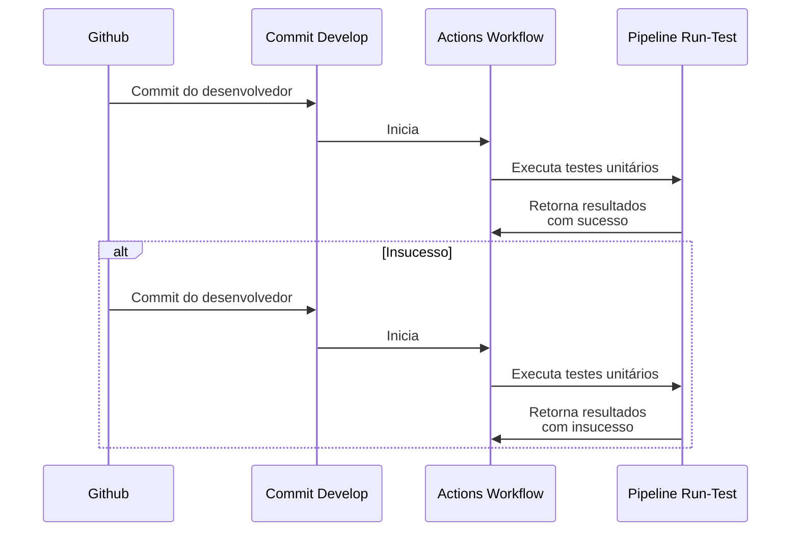
### Diagram de CI/CD ( Branch Master - PullRequest  )
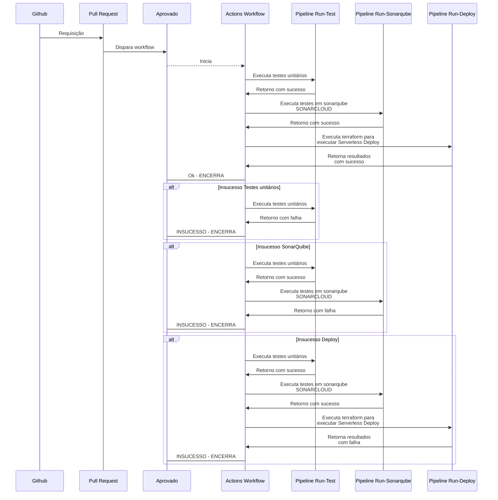

[Voltar ao topo](#ancora0)

<a id="ancora18"></a>
### Execução do projeto
>


Ao efetuar um push no repositório develop com sucesso, é necessário efetuar um pull request na branch master para que a execução do pipeline do workflow seja executado

[Voltar ao topo](#ancora0)
